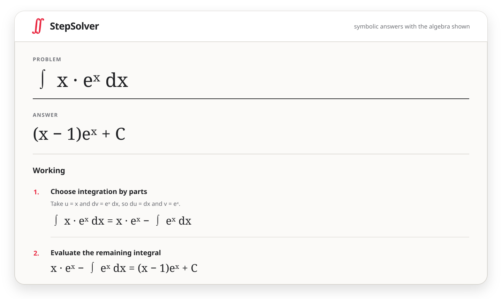

<div align="center">

# ∬ StepSolver

### A typed symbolic solver with worked steps.

</div>

> [!WARNING]
> This repository was written entirely by language models under human direction. Treat it as experimental software and review it accordingly.

<div align="center">

[Open the solver](https://davidegalilei.github.io/stepsolver/) · [Run it locally](#run-it) · [Syntax](#syntax)

[](https://www.python.org/)
[](https://python-poetry.org/)
[](#checks)
[](#checks)
[](LICENSE)

</div>

StepSolver accepts ASCII or visual math, parses it into its own typed AST, and returns checked solution steps. It is most useful today for single-variable calculus and algebra.

<p align="center">
  
</p>

## Run it

StepSolver supports Python 3.12 through 3.14 and uses Poetry.

```console
git clone https://github.com/DavideGalilei/stepsolver.git
cd stepsolver
poetry install
```

Start the graphical editor:

```console
poetry run stepsolver-web
```

Then open `http://127.0.0.1:8000`.

Or use the CLI:

```console
poetry run stepsolver "solve(x^2 - 4 = 0, x)"
poetry run stepsolver "limit(sin(3*x)/x, x, 0)"
poetry run stepsolver "integrate(1/(sqrt(x)*(x+1)), x)"
```

## Python API

The steps shown by the web app come from the library result. The frontend does not infer or rewrite them.

```python
from stepsolver import ExactResult, Solver, format_expression

result = Solver().solve("integrate(x*exp(x), x)")

if isinstance(result, ExactResult):
    for step in result.steps:
        print(step.rule)
        print(step.explanation)
        print(format_expression(step.before), "->", format_expression(step.after))

        for note in step.notes:
            print(note.label, format_expression(note.expression))

        print(step.verification.method.value)
        print(step.verification.detail)
```

`SolutionStep` contains the rule name, prose explanation, before and after AST nodes, supporting identities or substitutions, and a verification record. Results and steps are immutable. Exact, divergent, and unsolved outcomes are separate result types.

### Render steps like the web app

`solve_payload()` is the presentation adapter used by the HTTP and browser runtimes. It converts the domain result into ASCII and LaTeX without changing the derivation.

```python
from stepsolver import Solver, solve_payload

result = Solver().solve("integrate(x*exp(x), x)")
payload = solve_payload(result)

print(payload.status)
print(payload.result_latex)

for step in payload.steps:
    print(step.number, step.rule)
    print(step.explanation)
    print(step.before_latex, r"\longrightarrow", step.after_latex)

    for note in step.notes:
        print(note.label, note.expression_latex)
```

`payload.as_dict()` returns standard Python containers suitable for JSON serialization.

### Parse first, solve later

The parser produces StepSolver's own immutable AST. A parsed `Query` can be inspected, stored, or passed to a solver.

```python
from stepsolver import Operation, Solver, parse

query = parse("limit(sin(x)/x, x, 0)")

assert query.operation is Operation.LIMIT
print(query.arguments)

result = Solver().solve(query)
```

### Choose a symbolic backend

`Solver` is the orchestration layer. `SymbolicBackend` is its engine contract, and `SympyBackend` is the included implementation.

```python
from stepsolver import Solver, SymbolicBackend, SympyBackend

backend: SymbolicBackend = SympyBackend()
solver = Solver(backend=backend)
result = solver.solve("factor(x^2 - 1)")
```

The main abstractions are:

| Layer | Public API | Purpose |
| --- | --- | --- |
| Notation | `parse`, `parse_expression` | Convert ASCII into the custom AST |
| Query model | `Query`, `Operation`, `Expression` | Represent mathematical intent without SymPy objects |
| Orchestration | `Solver` | Accept source text or a parsed query and invoke an engine |
| Engine boundary | `SymbolicBackend`, `SympyBackend` | Isolate symbolic computation behind a typed protocol |
| Domain result | `SolveResult`, `SolutionStep`, `StepNote` | Return answers, derivations, explanations, and verification |
| Presentation | `solve_payload`, `SolvePayload`, `StepPayload` | Render the same result as frontend-ready ASCII and LaTeX |

## Syntax

ASCII input uses explicit operators. Write `2*x`, not `2x`. Constants include `pi`, `e`, `i`, and `oo`.

| Area | Operations |
| --- | --- |
| Algebra | `simplify`, `expand`, `factor`, `solve`, `solve_inequality` |
| Calculus | `diff`, `integrate`, `limit`, `series` |
| Sums and products | `sum`, `product` |
| Matrices | `matrix`, `det`, `inverse`, `rank`, `rref`, `eigenvalues` |
| Transforms | `laplace`, `inverse_laplace`, `fourier`, `inverse_fourier` |
| Differential equations and recurrences | `dsolve`, `rsolve` |
| Number theory | `gcd`, `lcm`, `is_prime`, `prime_factors`, `binomial` |
| Numerical work | `numeric` |

Contour integrals use an explicit parameterized path:

```text
contour_integrate(1/z, z, exp(i*t), t, 0, 2*pi)
```

Natural-language input and implicit multiplication are not supported.

## How it is put together

- The ASCII and MathJSON parsers produce the same custom AST.
- SymPy performs symbolic computation behind an adapter.
- Derivation strategies turn results into named, verified steps.
- The CLI and web app render the same result model as ASCII or LaTeX.

SymPy objects do not leak into the public API. If the backend leaves an operation unevaluated, StepSolver reports that instead of presenting it as an answer.

## Checks

```console
poetry run ruff check .
poetry run mypy src tests
poetry run pyright
poetry run ty check
poetry run pytest --cov=stepsolver --cov-fail-under=90
poetry check --strict
```

## Status

This is early-stage research software, not a replacement for a mature computer algebra system. Some supported operations still lack good student-facing derivations; those cases are tracked in the tests.

## License

StepSolver is available under the [MIT License](LICENSE).
